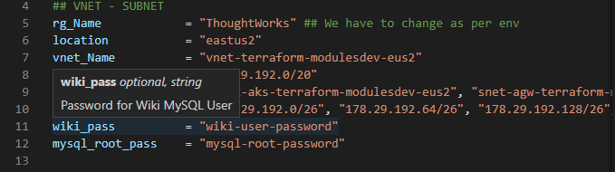

# **LAMP configuration using Terraform and Ansible.**
------
### Purpose of this code is to automate [LAMP deployment](https://en.wikipedia.org/wiki/LAMP_(software_bundle) "LAMP Wiki"). I will be deploying sample [MediaWiki Application](https://en.wikipedia.org/wiki/LAMP_(software_bundle) "MediaWiki") for your reference.

### **Assumptions :**

1. You are using Azure for your infrastructure deployment. 
2. The host machine where this code needs to be run is Linux. Since Ansible can't be installed on Windows. And WSL isn't offically supported.
3. Terraform module deploys RHEL 8 machine. This can be easily changed using *terraform.tfvars* file, since we are using variables for this deployment. This is explained in detail later.

### **Requirements :**

1. Linux Machine where we will install Terraform, Ansible and Azure CLI.
2. Basic familarity with command line interface.
3. Root privileges on this host machine.

### **Usage :**

***terraform-resources*** directory contains the actual terraform and ansible code. ***terraform-modules*** directory is used to write or define terraform modules. Which means you will be dealing with only *terraform-resources* folder most of the times.

**Things to keep in mind are :**

1. We are using Azure BLOB as backend configuration, so you need to ensure the storage account and container mentioned in the backend configuration exists. This is updated under backend section of main.tf file located in terraform-resources directory.
2. To ensure this configuration is secure. We are using Key Vault to store all our sensitive information. Since we are using data block to fetch key vault secrets, where we store all our sensitive information. The key vault and the secrets should already exist.
    * **wiki_pass** refers to the secret storing the password for the wiki MySQL user created as part of this process.
    * **mysql_root_pass** refers to the secret storing the password for the root MySQL user created as part of this MySQL secure installation.
    * **virtual_machine_Usr** refers to the secret storing the username for the Virtual Machine user.
    * **virtual_machine_Passwd** refers to the secret storing the password for the Virtual Machine user.

3. This deployment is using password authentication. In case you plan on using SSH keys, you need to edit line 67 to 74 on \terraform-modules\virtual_machine\main.tf and uncomment line 74 . I am using Password authentication to demonstrate how data block can be used to securely fetch username and password from keyvault. We can use [File function](https://www.terraform.io/language/functions/file "File Terraform") to specify our private key location.
4. We are using Terraform modules and variables to ensure this code is scalable. Before you start the deployment you need to update the required values in ***"terraform.tfvars"*** file under terraform-resources folder. If you aren't sure about the expected values. You can hover your mouse on the value to find out the description. Reference image below :

5. I have used conditionals in the terraform variables file to ensure we are performing error handling. You can edit or modify these conditionals if you have any specific custom requirements.
5. **Install_Loop.yaml" file contains the list of packages which needs to be installed. If you are planning to install anything additional. Just append the list and loop will take care of the setup.

To run this example, simply follow to steps below:

1. First you need to install Terraform and Ansible on your machine. You can use ***RHEL_Installation.sh*** or ***ubuntu_installation.sh*** located under terraform-resources based on the Linux distro.
2. Run 'az login' to login Azure Subscription where these resources need to be deployed.
3. After the setup, you need to navigate to terraform-resources folder, use :

``` 
  cd terraform-resources
  terraform init
  terraform plan
  terraform apply

```
### **Explanation :**

1. Terraform init -> It initializes the directory and downloads required provider along with configuring the module.
2. Terraform plan -> This helps you verify the code is going to deploy the resources as expected. This also ensures we don't face any unwanted surprise. This isn't mandatory, but a recommended step.
3. Terraform apply -> This step applies the resources specified in this code. This will ask you to approve this later. We can skip manual approval by using --auto-approve parameter.

### **Best Practices & Recommendations**

1. Use Terraform workspaces for easier management of the deployments. This can also help us manage Dev, UAT and Production deployments instead of creating multiple state files\directories. Additionally it helps us follow BlueGreen deployment.
2. If you are creating new resources\variables. Ensure naming convention is easily relatable, since we have a lot of variables in this code.
3. Use conditionals to avoid unwanted surprises and better error handling.
